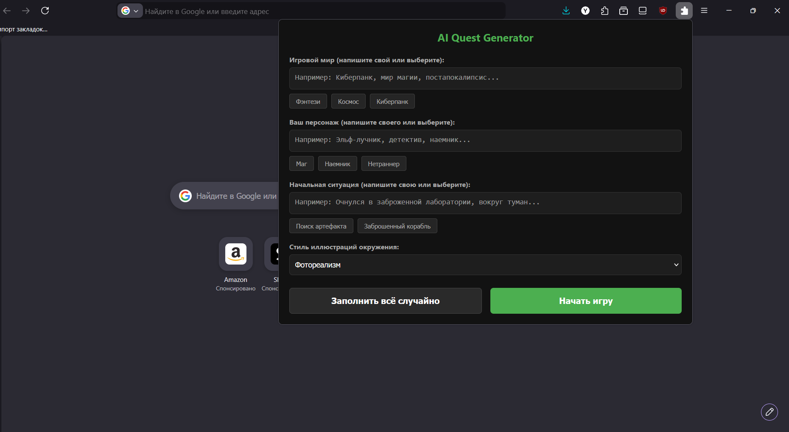
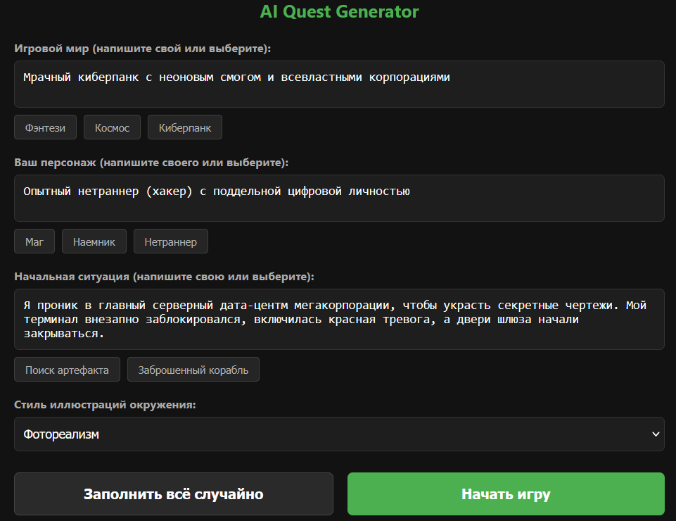
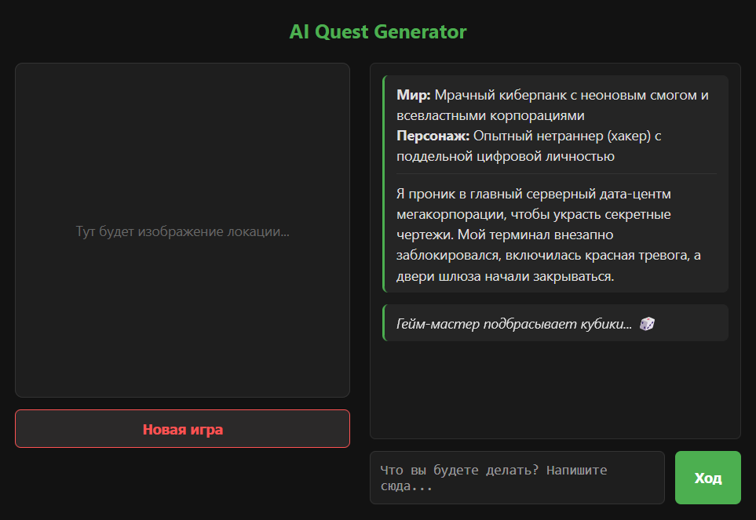
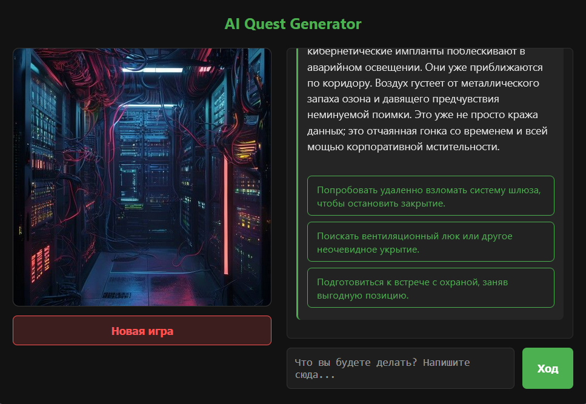
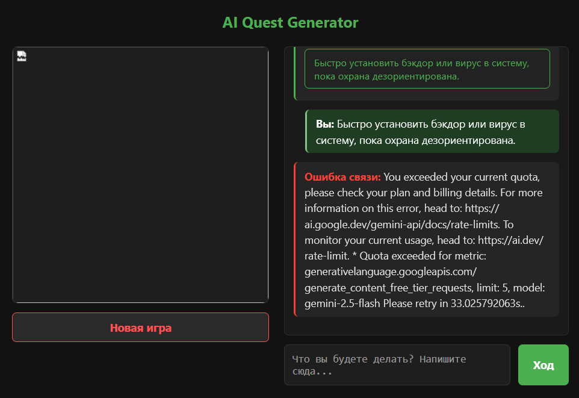
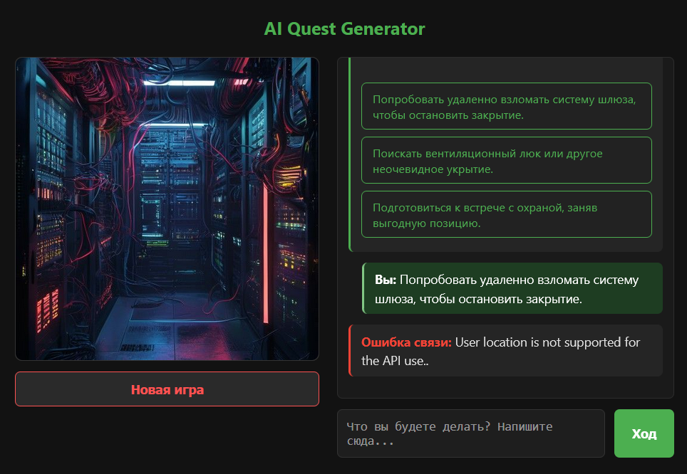

# AI Quest Generator

Интерактивная текстовая ролевая игра (RPG) в формате браузерного расширения, где игровой процесс, сюжетные развилки и иллюстрации локаций генерируются на лету с помощью передовых моделей искусственного интеллекта.

## Цель проекта
Разработка автономного игрового приложения в виде веб-расширения, способного динамически выстраивать текстовый квест на основе выбранного пользователем сеттинга (мир, персонаж) с адаптивной генерацией визуального сопровождения для каждой игровой сцены.

## Используемые технологии

* **Frontend (Интерфейс):** HTML5, CSS3 (адаптивная темная тема, анимации плавного появления элементов), Vanilla JavaScript (асинхронное управление игровым состоянием, манипуляции с DOM).
* **Архитектура расширения:** Web Extensions API (совместимо с Mozilla Firefox, Google Chrome и другими современными браузерами).
* **ИИ-Бэкенд (Генерация текста/сюжета):** Google Gemini API (модель `gemini-2.5-flash`), интегрированная через асинхронные `fetch`-запросы для создания ролевой системы "Гейм-мастера".
* **ИИ-Бэкенд (Генерация графики):** Pollinations AI API (модель `Flux`), использующая выделенный эндпоинт `image.pollinations.ai` для динамического рендеринга иллюстраций локаций по текстовым промптам (на английском языке).
* **Хранение данных:** `localStorage` / `chrome.storage` для сохранения прогресса текущей сессии игры.

## Основной функционал
1.  **Кастомизация старта:** Выбор готовых пресетов игрового мира (Мрачный киберпанк, Средневековое фэнтези, Космический хоррор, Постапокалипсис) или ввод собственного сеттинга.
2.  **Генеративный сюжет:** Каждое действие игрока обрабатывается языковой моделью, которая возвращает последствия выбора и генерирует три уникальных варианта дальнейших действий.
3.  **Визуализация атмосферы:** Автоматический перевод контекста сцены на английский язык и генерация уникального квадратного арта локации (512x512) для полного погружения.
4.  **Обработка лимитов и ошибок:** Встроенная система валидации сетевых запросов (обработка таймаутов, Rate Limit Google API и кодов ответов сторонних сервисов).

## Скриншоты работы программы

### 1. Главное меню и генерация первой сцены
*Описание: Интерфейс расширения сразу после запуска игры в сеттинге Киберпанк. Нейросеть сформировала стартовую позицию для персонажа-нетраннера.*

### 2. Динамический выбор действия и загрузка кадра
*Описание: Процесс отправки хода игрока. Виден блок ожидания («Нейросеть рисует кадр...»), пока обновленный эндпоинт генерирует изображение.*

### 3. Обработка ошибок сети и лимитов (Дебаг-интерфейс)
*Описание: Пример работы системы отслеживания ошибок. Приложение корректно выводит предупреждение о превышении квоты запросов (Rate Limit) от Gemini API без падения самого расширения.*

